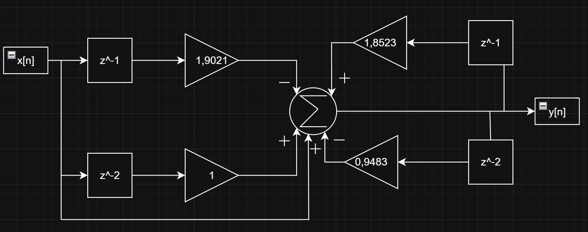

\newpage
\begin{titlepage}
\begin{center}

\large
UNIVERSIDADE FEDERAL DE UBERLÂNDIA\\
FACULDADE DE ENGENHARIA ELÉTRICA\\
GRADUAÇÃO EM ENGENHARIA BIOMÉDICA\\[7cm]

\Large
\textbf{Heitor Pereira Nunes Fernandes Cunha}\\[2cm]

\textbf{\large Processamento de Sinais Biomédicos: Módulo 8}\\[10cm]

\large
Uberlândia, MG\\
2025

\end{center}
\end{titlepage}

\newpage
\section*{Questão 1}

> Questão 1

Dado a frequência f = 0.3rad/s, calcule os valores de frequência em ciclos/s, rad/amostra e ciclos/amostra. Assuma o valor de fs = 200 Hz.

```{r}

# Definindo os valores
omega <- 0.3     # Frequência em rad/s
fs <- 200        # Frequência de amostragem em Hz (amostras/s)

# 1) Frequência em ciclos/s (Hz)
freq_ciclos_s <- omega / (2 * pi)

# 2) Frequência em rad/amostra
freq_rad_amostra <- omega / fs

# 3) Frequência em ciclos/amostra
freq_ciclos_amostra <- freq_ciclos_s / fs
# ou, equivalentemente:
# freq_ciclos_amostra <- freq_rad_amostra / (2*pi)

# Exibindo os resultados
cat("Frequência em ciclos/s (Hz) =", freq_ciclos_s, "ciclos/s\n")
cat("Frequência em rad/amostra =", freq_rad_amostra, "rad/amostra\n")
cat("Frequência em ciclos/amostr =", freq_ciclos_amostra, "ciclos/amostra\n")

```

\newpage
\section*{Questão 2}

> Questão 2

Gere 5 segundos de um sinal s, que deve ser a soma de dois sinais senoidais, sendo um oscilando a 60 ciclos/s e o outro a 100 ciclos por segundo. Adote a frequência de amostragem de 1,2 kHZ. Aplique a equação recursiva ao sinal se responda às questões abaixo:

y[n] = 1,8523y[n-1] - 0.94833y[n-2] + x[n] - 1.9021x[n-1] + x[n-2]

```{r}

library(dygraphs)
library(tidyverse)

# Parâmetros de geração do sinal
fs <- 1200           # Frequência de amostragem (Hz)
T <- 5               # Duração (s)
N <- T * fs          # Número total de amostras

# Vetor de tempo
t <- seq(0, by = 1/fs, length.out = N)

# 2) Gerando o sinal x[n] = sen(2pi60t) + sen(2pi100t)

f1 <- 60             # 60 Hz
f2 <- 100            # 100 Hz

# Sinais senoidais
x1 <- sin(2*pi*f1*t)
x2 <- sin(2*pi*f2*t)

# Sinal total de entrada
x <- x1 + x2

# Aplicando a equação recursiva:

# Para armazenar a saída y:
y <- numeric(N)

for (n in 3:N) {
  y[n] <- 1.8523 * y[n-1] - 0.94833 * y[n-2] +
          x[n]     - 1.9021 * x[n-1]   + x[n-2]
}

# Visualização ou análise de resultados

# Plot do sinal de entrada
plot(t[1:(fs)], x[1:(fs)], type = "l", 
     main = "Sinal de entrada x[n]",
     xlab = "Tempo (s)", ylab = "Amplitude")

# Plot do sinal de saída
plot(t[1:(fs)], y[1:(fs)], type = "l", 
     main = "Saída após a equação recursiva",
     xlab = "Tempo (s)", ylab = "Amplitude")

```

> Letra A

Qual foi o principal efeito de se aplicar a equação de y[n] sobre o sinal s?

O principal efeito de aplicar a equação recursiva: y[n] = 1,8523y[n-1] - 0.94833y[n-2] + x[n] - 1.9021x[n-1] + x[n-2], sobre o sinal s (soma das senoides de 60 Hz e 100 Hz) é filtrar essas componentes de frequência de maneira que uma ou ambas sejam atenuadas ou reforçadas, dependendo de como os polos e zeros do filtro (definido pelos coeficientes) afetam cada faixa de frequência; em outras palavras, o filtro modifica a amplitude e a fase das senoides originais, resultando em um sinal de saída que não é mais a simples soma das duas ondas, mas sim uma versão alterada por esse sistema de segunda ordem.

> Letra B

Esboce o diagrama de blocos que ilustre o processador descrito por y[n].



\newpage
\section*{Questão 3}

> Questão 3

Calcule a resposta ao impulso unitário, h[n], para o processador:

y[n] = y[n−1] + (1/L)*x[n] − x[n−L].

Para calcular a resposta em frequência, suponhamos que L = 2. Portanto, temos que aplicar afunção δ[n] à entrada do sistema, de forma que:

y[0] = h[0] = 0 + (1/2)*1 - 0 = 1/2  
y[1] = h[1] = y[1-1] + (1/2)*x[1] - x[1-2] = 1 + 0 + 0 = 1  
y[2] = h[2] = y[2-1] + (1/2)*x[2] - x[2-2] = 0 + 0 + 1 = 1  
y[3] = h[3] = y[3-1] + (1/2)*x[3] - x[3-2] = 0 + 0 + 0 = 0  
y[4] = h[4] = y[4-1] + (1/2)*x[4] - x[4-2] = 0 + 0 + 0 = 0  

Sendo assim, a repsosta ao impulso do problema é: [1/2, 1, 1, 0, 0, ...]

\newpage
\section*{Questão 4}

> Questão 4

Gere 5 segundos de um sinal senoidal amostra a 500 Hz, oscilando a 30 Hz, e adicione ruído gaussiano (com amplitude de no máximo 10% ao valor máximo do sinal senoida). Aplique o processador da questão 3 ao sinal resultante. Qual foi o efeito observado? Plote os gráficos do sinal origina, corrompido e processado.

```{r}

# Carregando pacotes necessários
library(tuneR)
library(dplyr)
library(ggplot2)

# Parâmetros do sinal
tempo_final <- 5
taxa_amostragem <- 500
frequencia_sinal <- 30
delta_tempo <- 1 / taxa_amostragem
vetor_tempo <- seq(0, tempo_final, by = delta_tempo)

# Gerando sinal senoidal puro
sinal_puro <- sin(2 * pi * frequencia_sinal * vetor_tempo)
df_sinal_puro <- data.frame(tempo = vetor_tempo, valor = sinal_puro, tipo = "Sinal Original")

# Gerando ruído branco
sinal_ruido <- noise(kind = "white", duration = tempo_final + delta_tempo,
                     samp.rate = taxa_amostragem, xunit = "time")@left

# Sinal corrompido com ruído
sinal_ruidoso <- sinal_puro + sinal_ruido
df_ruidoso <- data.frame(tempo = vetor_tempo, valor = sinal_ruidoso, tipo = "Sinal Corrompido")

# Preparando estrutura para processamento do sinal
df_processado <- df_sinal_puro %>%
  mutate(
    xn  = valor,
    xn1 = lag(valor, 1) * (-1.9021),
    xn2 = lag(valor, 2)
  )

# Inicializando vetor de saída processada
saida_filtrada <- rep(NA, length(vetor_tempo))
saida_filtrada[1:2] <- 0

# Aplicando filtro IIR
for (i in 3:length(saida_filtrada)) {
  entrada_sum <- sum(df_processado$xn[i],
                     df_processado$xn1[i],
                     df_processado$xn2[i], na.rm = TRUE)
  
  saida_filtrada[i] <- 1.8523 * saida_filtrada[i - 1] -
                       0.94833 * saida_filtrada[i - 2] +
                       entrada_sum
}

# Montando o data frame do sinal processado
df_final <- data.frame(tempo = vetor_tempo,
                       valor = saida_filtrada,
                       tipo = "Sinal Processado")

# Combinando todos os sinais para visualização
df_completo <- bind_rows(
  df_sinal_puro %>% rename(tempo = tempo, valor = valor) %>% select(tempo, valor, tipo),
  df_ruidoso,
  df_final
)

# Garantindo a ordem correta dos painéis
df_completo$tipo <- factor(df_completo$tipo,
                           levels = c("Sinal Original", "Sinal Corrompido", "Sinal Processado"))

# Criando gráfico em painel (facet)
painel <- ggplot(df_completo, aes(x = tempo, y = valor)) +
  geom_line(color = "darkgreen") +
  facet_wrap(~ tipo, nrow = 3, scales = "free_y") +
  labs(x = "Tempo (s)", y = "Amplitude") +
  theme_minimal(base_size = 14)

# Exibindo gráfico
painel


```
\newpage
\section*{Questão 5}

> Questão 5

Calcule a resposta em frequência, H(z) de y[n]=0.5[x(n)+x[n−1]]. Faça o gráfico da amplitude e fase. Que tipo de processador é esse?

```{r}

# Carregar bibliotecas necessárias
library(signal)
library(REdaS)
library(ggplot2)

numerador <- c(0.5, 0.5)
denominador <- c(1)
taxa_amostragem <- 500

# Calcular a resposta em frequência do filtro
resposta_freq <- freqz(numerador, denominador, Fs = taxa_amostragem)

# Obter módulo da resposta em frequência
modulo <- Mod(resposta_freq$h)

# Calcular fase em radianos e converter para graus
fase_rad <- Arg(resposta_freq$h)
fase_graus <- rad2deg(fase_rad)

# Converter módulo para escala decibéis
modulo_db <- 20 * log10(modulo)

# Criar dataframe com os resultados para visualização
dados_plot <- data.frame(
  frequencia = resposta_freq$f,
  resposta_complexa = resposta_freq$h,
  fase_rad,
  fase_graus,
  modulo,
  modulo_db
)

# Gráfico do módulo
ggplot(dados_plot, aes(x = frequencia, y = modulo)) +
  geom_line() +
  theme_classic() +
  labs(title = "Módulo da Resposta em Frequência", x = "Frequência (Hz)", y = "|H(f)|")

# Gráfico da fase em graus
ggplot(dados_plot, aes(x = frequencia, y = fase_graus)) +
  geom_line() +
  theme_classic() +
  labs(title = "Fase da Resposta em Frequência", x = "Frequência (Hz)", y = "Fase (graus)")

# Gráfico do módulo em decibéis
ggplot(dados_plot, aes(x = frequencia, y = modulo_db)) +
  geom_line() +
  theme_classic() +
  labs(title = "Resposta em Frequência (dB)", x = "Frequência (Hz)", y = "Magnitude (dB)")

```

<br>Trata-se de um filtro FIR de 2 coeficientes que efetua a média simples de duas amostras consecutivas (1/2*[x(n)+x(n−1)]). Em termos de resposta em frequência, ele se comporta como um filtro passa-baixas, atenuando as componentes em altas frequências (onde atinge ganho zero em w = pi) e mantém o ganho máximo de w = 0.

\newpage
\section*{Questão 6}

> Questão 6

Simule três bursts de sinais eletromiográficos em um tempo de 10 s. Cada burst deve ter a duração de 2 segundos. Assuma que o sinal foi amostrado a 1000 Hz. Promova um ganho de 1.2 vezes nos trecho em que há atividade eletromiográfica. Filtre o sinal gerado com um fitro passa-baixa, com frequência de corte de 5 Hz e ordem 3. Faça a comparação entre sinais filtrados pelos filtros Butterworth e Chebyshev. Plote os gráficos dos sinais obtidados e as respostas em frequência dos filtros utilizados. Dicas: (i) para a geração do sinal utilize a função randn. (ii) Para a filtragem do sinal utilize a função filtfilt.

```{r}

library(signal)
library(dygraphs)

taxa_amostragem <- 1000
dt <- 1 / taxa_amostragem
tempo <- seq(0, 10, by = dt)
duracao <- max(tempo)
num_bursts <- 3

onda_base <- square(num_bursts, samp.rate = taxa_amostragem, duration = duracao + dt, xunit = "time")@left
ruido_burst <- noise(kind = "white", samp.rate = taxa_amostragem, duration = duracao + dt, xunit = "time")@left
ruido_gauss <- rnorm(length(tempo))

# Construção do sinal EMG
sinal_emg <- rep(NA, length(tempo))
indices_ruido <- which(onda_base == -1.0)
indices_burst <- which(onda_base > -1.0)

# Inserindo ruído gaussiano
sinal_emg[indices_ruido] <- ruido_gauss[indices_ruido]

# Inserindo bursts
ganho_burst <- 1.2 * 20
sinal_emg[indices_burst] <- ruido_burst[indices_burst] * ganho_burst

# DataFrame com sinal original
dados_emg <- data.frame(tempo = tempo, emg = sinal_emg)

# Sinal original
dygraph(dados_emg, main = "Sinal EMG com Bursts") %>%
  dyAxis("x", label = "Tempo (s)") %>%
  dyAxis("y", label = "Amplitude") %>%
  dyRangeSelector()

# Filtro Butterworth
ordem <- 3
fc <- 5  
frequencia_normalizada <- fc / (taxa_amostragem / 2)

filtro_butter <- butter(ordem, frequencia_normalizada, type = "low")
freqz(filt = filtro_butter, Fs = taxa_amostragem)

sinal_filtrado_butter <- filtfilt(filtro_butter, sinal_emg)
dados_butter <- data.frame(tempo = tempo, sinal = sinal_filtrado_butter)

# Sinal filtrado Butterworth
dygraph(data.frame(tempo = tempo, Original = sinal_emg, Butterworth = sinal_filtrado_butter),
        main = "Filtro Butterworth") %>%
  dySeries("Original", strokeWidth = 1, color = "black") %>%
  dySeries("Butterworth", strokeWidth = 2, color = "orange") %>%
  dyRangeSelector()

# Filtro Chebyshev
ripple <- 0.5  
filtro_cheby <- cheby1(ordem, ripple, frequencia_normalizada, type = "low")
freqz(filt = filtro_cheby, Fs = taxa_amostragem)

sinal_filtrado_cheby <- filtfilt(filtro_cheby, sinal_emg)

#Sinal filtrado Chebyshev
dygraph(data.frame(tempo = tempo, Original = sinal_emg, Chebyshev = sinal_filtrado_cheby),
        main = "Filtro Chebyshev") %>%
  dySeries("Original", strokeWidth = 1, color = "black") %>%
  dySeries("Chebyshev", strokeWidth = 2, color = "darkgreen") %>%
  dyRangeSelector()

# Comparação Butterworth e Chebyshev
dygraph(data.frame(tempo = tempo,
                   Butterworth = sinal_filtrado_butter,
                   Chebyshev = sinal_filtrado_cheby),
        main = "Comparação entre Filtros") %>%
  dySeries("Butterworth", strokeWidth = 2, color = "red") %>%
  dySeries("Chebyshev", strokeWidth = 2, color = "blue") %>%
  dyRangeSelector()


```
